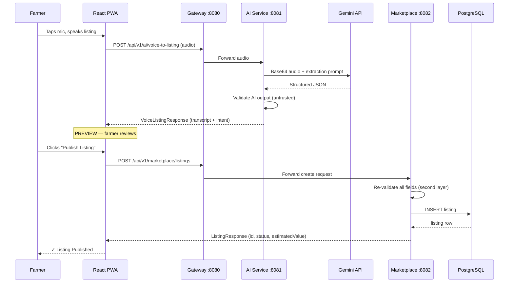

# 🌿 TrueYield – Voice Listing Assistant

> **The first working module of the TrueYield agricultural marketplace platform.**
> A farmer speaks. The system listens. A marketplace listing is created — with human confirmation at every step.

---

## Problem Statement

Many farmers find traditional digital marketplace forms difficult to use: typing is slow, forms are complex, and mobile keyboards are awkward in a field.

**TrueYield** introduces a Voice Listing Assistant. A farmer taps a microphone button and says:

> "I have 50 kilograms of good quality rambutan. I want 450 rupees per kilogram."

The system understands, extracts structured information, shows the farmer a confirmation card, and — only after the farmer taps **Publish** — creates the listing in the marketplace database.

---

## Architecture

```
Farmer
  │  Voice
  ▼
React PWA (localhost:5173)
  │  REST multipart/form-data
  ▼
Spring Cloud Gateway (:8080)
  │
  ├──▶  AI Service (:8081)
  │         │  audio bytes
  │         ▼
  │       Google Gemini 1.5 Flash
  │         │  structured JSON
  │         ▼
  │       Validation (untrusted AI output)
  │         │  validated DTO
  │         └──▶  Frontend: PREVIEW state
  │
  └──▶  Marketplace Service (:8082)
            │  re-validates all fields
            ▼
          PostgreSQL (:5432)
```

### Key Principle: AI Never Touches the Database

```
✅  Gemini → AI Service DTO → Marketplace Service → PostgreSQL
❌  Gemini → PostgreSQL
```

---

## Sequence Diagram



---

## Technology Stack

| Layer              | Technology                                     |
|--------------------|------------------------------------------------|
| Frontend           | React 18, Vite, TypeScript, Tailwind CSS, PWA  |
| API Gateway        | Spring Cloud Gateway (Spring Boot 3.3, Java 21)|
| AI Service         | Spring Boot 3.3, Java 21, RestClient           |
| AI Model           | Google Gemini 1.5 Flash                        |
| Marketplace Service| Spring Boot 3.3, Spring Data JPA, Hibernate    |
| Database           | PostgreSQL 16                                  |
| Containerization   | Docker, Docker Compose                         |

---

## Project Structure

```
trueyield-voice-assistant/
├── frontend/                         # React PWA
│   ├── src/
│   │   ├── api/                      # Axios clients (voiceApi, listingsApi)
│   │   ├── components/               # MicrophoneButton, ListingPreviewCard, …
│   │   ├── hooks/                    # useVoiceRecorder, useListingFlow
│   │   ├── pages/                    # HomePage, ListingsPage
│   │   └── types/                    # TypeScript interfaces
│   └── package.json
│
├── services/
│   ├── api-gateway/                  # Spring Cloud Gateway
│   │   └── src/main/resources/application.yml
│   │
│   ├── ai-service/                   # Voice → Gemini → DTO → Validation
│   │   └── src/main/java/com/trueyield/ai/
│   │       ├── controller/           # VoiceListingController
│   │       ├── service/              # GeminiClient, VoiceListingService
│   │       │                         # ListingIntentValidator
│   │       ├── dto/                  # ListingIntentResponse, VoiceListingResponse
│   │       ├── enums/                # Intent, Product, Unit, Quality
│   │       ├── config/               # GeminiConfig
│   │       └── exception/            # GlobalExceptionHandler
│   │
│   └── marketplace-service/          # Validation → JPA → PostgreSQL
│       └── src/main/java/com/trueyield/marketplace/
│           ├── controller/           # ListingController
│           ├── service/              # ListingService
│           ├── repository/           # ListingRepository
│           ├── entity/               # Listing
│           ├── dto/                  # CreateListingRequest, ListingResponse
│           ├── mapper/               # ListingMapper
│           └── exception/            # GlobalExceptionHandler
│
├── infrastructure/
│   └── postgres/init.sql             # DB schema + seed data
│
├── docker-compose.yml
├── .env.example
└── README.md
```

---

## How Voice Processing Works

1. Browser records audio using `MediaRecorder` API (WebM/Opus format)
2. Audio blob is `POST`ed to `/api/v1/ai/voice-to-listing` as `multipart/form-data`
3. Gateway forwards to **AI Service**
4. AI Service base64-encodes the audio and sends it to **Gemini 1.5 Flash** with a structured extraction prompt
5. Gemini transcribes the audio and returns **only JSON** — no markdown, no explanation
6. AI Service parses and **validates** the JSON (untrusted AI output)
7. Validated `VoiceListingResponse` is returned to the frontend
8. Frontend shows a **human confirmation card** — the farmer must explicitly tap **Publish**
9. Only then is `POST /api/v1/marketplace/listings` called
10. Marketplace Service **re-validates** the request and persists to **PostgreSQL**

---

## API Documentation

### AI Service

#### `POST /api/v1/ai/voice-to-listing`

Upload a voice recording for intent extraction.

**Request:** `multipart/form-data`
| Field | Type | Description |
|-------|------|-------------|
| `audio` | File | Recorded audio (WebM, MP4, OGG, WAV) |

**Success Response (200):**
```json
{
  "success": true,
  "data": {
    "transcript": "I have 50 kilograms of good quality rambutan. I want 450 rupees per kilogram.",
    "listing": {
      "intent": "CREATE_LISTING",
      "product": "RAMBUTAN",
      "quantity": 50,
      "unit": "KG",
      "quality": "GOOD",
      "pricePerUnit": 450
    }
  },
  "timestamp": "2026-09-07T10:30:00"
}
```

**Error Response (503 — AI unavailable):**
```json
{
  "success": false,
  "code": "AI_SERVICE_UNAVAILABLE",
  "message": "We could not understand your voice. Please try again.",
  "timestamp": "2026-09-07T10:30:00"
}
```

---

### Marketplace Service

#### `POST /api/v1/marketplace/listings`

Create a new listing after human confirmation.

**Request body:**
```json
{
  "product": "RAMBUTAN",
  "quantity": 50,
  "unit": "KG",
  "quality": "GOOD",
  "pricePerUnit": 450
}
```

**Success Response (201):**
```json
{
  "success": true,
  "data": {
    "id": "a3f2e1b0-...",
    "product": "RAMBUTAN",
    "quantity": 50,
    "unit": "KG",
    "quality": "GOOD",
    "pricePerUnit": 450,
    "estimatedValue": 22500,
    "status": "AVAILABLE",
    "createdAt": "2026-09-07T10:30:00",
    "updatedAt": "2026-09-07T10:30:00"
  },
  "timestamp": "2026-09-07T10:30:00"
}
```

#### `GET /api/v1/marketplace/listings`

Get all listings (newest first).

#### `GET /api/v1/marketplace/listings/{id}`

Get a single listing by UUID.

---

## Database Structure

```sql
CREATE TABLE listings (
    id            UUID          PRIMARY KEY DEFAULT uuid_generate_v4(),
    product       VARCHAR(50)   NOT NULL,
    quantity      NUMERIC(12,2) NOT NULL CHECK (quantity > 0),
    unit          VARCHAR(20)   NOT NULL,
    quality       VARCHAR(20)   NOT NULL,
    price_per_unit NUMERIC(12,2) NOT NULL CHECK (price_per_unit > 0),
    status        VARCHAR(30)   NOT NULL DEFAULT 'AVAILABLE',
    created_at    TIMESTAMP     NOT NULL DEFAULT NOW(),
    updated_at    TIMESTAMP     NOT NULL DEFAULT NOW()
);
```

---

## Environment Variables

Copy `.env.example` to `.env` and fill in your values:

```bash
cp .env.example .env
```

| Variable | Required | Description |
|----------|----------|-------------|
| `GEMINI_API_KEY` | **Yes** | Google AI Studio API key |
| `POSTGRES_DB` | No | Database name (default: `trueyield`) |
| `POSTGRES_USER` | No | DB username (default: `trueyield_user`) |
| `POSTGRES_PASSWORD` | No | DB password (default: `trueyield_pass`) |
| `GATEWAY_PORT` | No | Gateway port (default: `8080`) |
| `AI_SERVICE_PORT` | No | AI Service port (default: `8081`) |
| `MARKETPLACE_SERVICE_PORT` | No | Marketplace port (default: `8082`) |

> ⚠️ **Never commit `.env` to version control.** It is excluded by `.gitignore`.

Get a Gemini API key at: https://aistudio.google.com/app/apikey

---

## Local Setup

### Prerequisites

- Java 21+
- Maven 3.9+
- Node.js 20+
- Docker + Docker Compose
- A `GEMINI_API_KEY`

### 1. Clone and configure

```bash
git clone <repo>
cd trueyield-voice-assistant
cp .env.example .env
# Edit .env and set GEMINI_API_KEY=your_key_here
```

### 2. Start backend with Docker Compose

```bash
docker-compose up -d
```

Services started:
| Service | URL |
|---------|-----|
| PostgreSQL | `localhost:5432` |
| API Gateway | `http://localhost:8080` |
| AI Service | `http://localhost:8081` |
| Marketplace Service | `http://localhost:8082` |

Check health:
```bash
curl http://localhost:8080/actuator/health
```

### 3. Start the frontend

```bash
cd frontend
npm install
npm run dev
```

Open: **http://localhost:5173**

---

## Running Backend Services Locally (Without Docker)

If you prefer to run services directly with Maven:

```bash
# Terminal 1 — PostgreSQL (still needs Docker)
docker-compose up postgres

# Terminal 2 — Marketplace Service
cd services/marketplace-service
mvn spring-boot:run

# Terminal 3 — AI Service
cd services/ai-service
GEMINI_API_KEY=your_key mvn spring-boot:run

# Terminal 4 — API Gateway
cd services/api-gateway
mvn spring-boot:run
```

---

## Running Tests

```bash
# AI Service tests
cd services/ai-service
mvn test

# Marketplace Service tests
cd services/marketplace-service
mvn test
```

Expected test output:
```
[INFO] Tests run: 10, Failures: 0, Errors: 0
[INFO] Tests run: 4,  Failures: 0, Errors: 0
```

---

## Demo Scenario

1. Open **http://localhost:5173**
2. Tap the **🎤 microphone button**
3. Say: *"I have 50 kilograms of good quality rambutan. I want 450 rupees per kilogram."*
4. Tap the button again to stop recording
5. Review the extracted listing preview
6. Tap **🚀 Publish Listing**
7. See the ✓ success confirmation with Listing ID

---

## Example Voice Input & AI Output

**Input (spoken):**
```
I have 50 kilograms of good quality rambutan. I want 450 rupees per kilogram.
```

**Gemini extracts:**
```json
{
  "transcript": "I have 50 kilograms of good quality rambutan. I want 450 rupees per kilogram.",
  "intent": "CREATE_LISTING",
  "product": "RAMBUTAN",
  "quantity": 50,
  "unit": "KG",
  "quality": "GOOD",
  "pricePerUnit": 450
}
```

**Listing created in DB:**
```json
{
  "id": "a3f2e1b0-1234-5678-abcd-ef0123456789",
  "product": "RAMBUTAN",
  "quantity": 50,
  "unit": "KG",
  "quality": "GOOD",
  "pricePerUnit": 450,
  "estimatedValue": 22500,
  "status": "AVAILABLE",
  "createdAt": "2026-09-07T10:30:00"
}
```

---

## Security Considerations

- `GEMINI_API_KEY` is read from environment variables only — never hardcoded
- API key is never logged (log sanitization in `GeminiConfig`)
- AI output is always validated (untrusted input principle)
- `estimatedValue` is calculated server-side — never accepted from clients
- Spring Security permits all requests (demo mode) — add authentication before production
- `.env`, `application-local.yml` excluded from git via `.gitignore`

---

## Architecture Principles

| Principle | Implementation |
|-----------|----------------|
| AI extracts, humans confirm | `PREVIEW` state before any DB write |
| AI never owns business logic | Validation in `ListingIntentValidator` + `ListingService` |
| AI never touches the database | `ai-service` has no `spring-data-jpa` dependency |
| Never trust AI output | Double validation — AI Service + Marketplace Service |
| Never trust frontend totals | `estimatedValue` calculated in `ListingMapper` |
| DTOs between layers | Entity never exposed from controller |
| Secrets via env vars | `GEMINI_API_KEY` from environment only |

---

## Future Improvements (Next Stages)

- [ ] **Sinhala / Tamil support** — language detection + multilingual Gemini prompts
- [ ] **Kafka events** — listing created event → notifications, inventory, analytics
- [ ] **Farmer authentication** — JWT-based farmer identity
- [ ] **Image upload** — photo of produce alongside voice
- [ ] **Buyer matching** — market demand + listing search
- [ ] **Price suggestions** — current market rate overlay
- [ ] **Order creation** — buyer flow with Kafka order events
- [ ] **Push notifications** — PWA push when a buyer views listing
